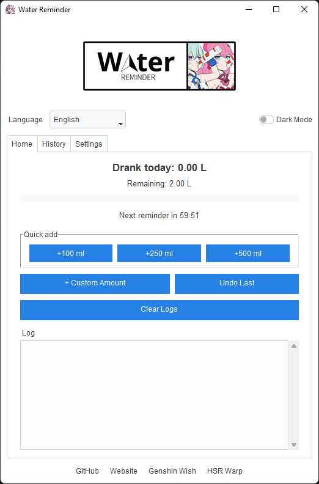
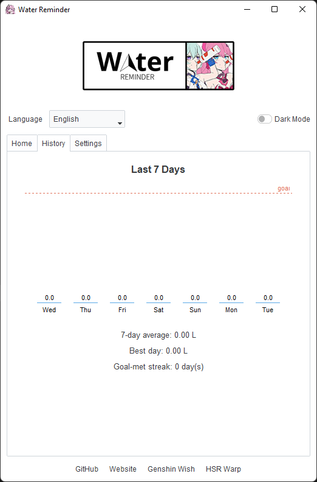
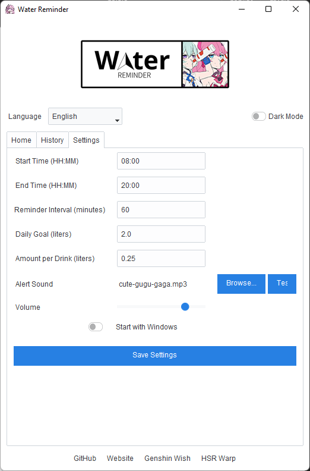

# Water Reminder App





## Description
This desktop app helps you stay hydrated by reminding you to drink water at regular intervals throughout the day. Set your active hours, reminder frequency, and a daily goal, then track your progress visually as you go.

## Features
- **Customizable Schedule:** Set the start and end time during which reminders are active.
- **Reminder Interval:** Choose how frequently you want to be reminded.
- **Daily Goal & Progress Bar:** Set a target amount of water and watch a live progress bar fill up as you log drinks.
- **Quick Add:** Log a drink in one click with 100 ml / 250 ml / 500 ml quick-add buttons, or enter a custom amount.
- **Undo Last:** Made a mistake? Instantly remove the most recent entry.
- **History Tab:** See a 7-day bar chart of your intake, your daily average, your best day, and your current goal-met streak.
- **Light & Dark Mode:** Toggle between light and dark themes, with the logo and every screen adapting automatically.
- **Sound Alerts:** Choose your own alert sound, preview it with a Test button, and adjust the volume.
- **System Tray:** Minimize to the tray and log a drink straight from the tray menu without reopening the window.
- **Multi-language Support:** Switch the display language from the app itself.
- **Automatic Daily Reset:** Your progress resets each day at midnight while your full history stays saved.
- **Cross-Platform Friendly:** Runs on Windows with full features (including "Start with Windows" and native toast notifications); on macOS/Linux the app runs normally with those Windows-only extras gracefully disabled.

## How to Use
1. **Installation:**
   - Clone the repository:
     ```
     git clone https://github.com/goenyan/WaterReminder.git
     ```
   - Run `Install.bat` to install required dependencies

2. **Usage:**
   - Run `Run.bat` to launch the application
   - Set your preferred schedule, reminder interval, and daily goal in the Settings tab
   - Log your drinks from the Home tab as you go, and check your progress in the History tab

3. **Logging:**
   - Every drink you log is saved automatically, so your progress and history persist between sessions.

4. **App update:**
   - Run `Update.bat` to update the application

## Requirements
- Python 3.x
- Dependencies (install using `pip`):
  ```
  pip install -r requirements.txt
  ```

## Contributing
Contributions are welcome! Feel free to submit issues and pull requests.

## License
This project is licensed under the MIT License - see the [LICENSE](LICENSE) file for details.
