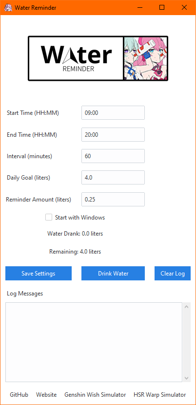

# Water Reminder App



## Description
This Python application helps you stay hydrated by reminding you to drink water at regular intervals throughout the day. You can customize the running time, reminder intervals, and set a daily goal for water intake. The app also maintains a log to track your hydration progress.

## Features
- **Customizable Running Time:** Set the time duration during which the app will remind you to drink water.
- **Reminder Interval:** Choose how frequently you want to receive reminders.
- **Daily Goal:** Set a target amount of water to drink each day.
- **Progress Log:** Keep track of your daily water intake to monitor your hydration levels.

## How to Use
1. **Installation:**
   - Clone the repository:
     ```
     git clone https://github.com/goenyan/WaterReminder.git
     ```
   - Navigate to the project directory.

2. **Usage:**
   - Run `Install.bat` to install required modules
   - Run `Run.bat` to launch the application
   - Follow the prompts to set your preferences for running time, reminder interval, and daily goal.

3. **Logging:**
   - View your daily progress in the log file generated by the app.
   
3. **App update:**
   - Run `Update.bat` to update the application
## Requirements
- Python 3.x
- Dependencies (install using `pip`):
	```
     pip install -r requirements.txt
     ```
## Contributing
Contributions are welcome! Feel free to submit issues and pull requests.

## License
This project is licensed under the MIT License - see the [LICENSE](LICENSE) file for details.
